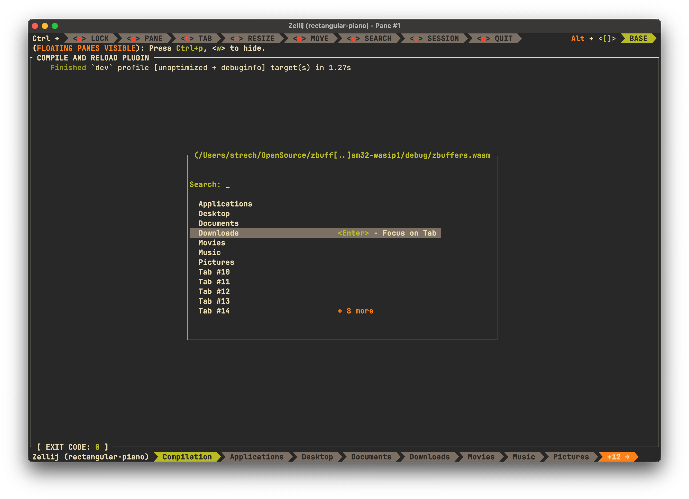

# zbuffers

[Zellij]: https://zellij.dev/
[Zellij config]: https://zellij.dev/documentation/configuration.html
[vertico/switch-workspace-buffer]: https://github.com/minad/vertico
[session-manager]: https://zellij.dev/documentation/session-resurrection
[latest release]: https://github.com/strech/zbuffers/releases/latest

Convenient switching between tabs with search capabilities.

A [Zellij] plugin heavily inspired by Emacs [vertico/switch-workspace-buffer] and
Zellij [session-manager] resurection tab.

[](https://github.com/user-attachments/assets/6810ff9b-95c3-453d-9fcf-951879926ab4)

#### If you like the project and want to support me on my sleepless nights, you can

[](https://www.paypal.com/paypalme/onistrech/eur5.0)
[](https://ko-fi.com/W7W8367XJ)

# Installation

Download the plugin binary from the [latest release]

```
$ mkdir -p ~/.config/zellij/plugins && \
   curl -L "https://github.com/strech/zbuffers/releases/latest/download/zbuffers.wasm" \
        -o ~/.config/zellij/plugins/zbuffers.wasm
```

Add this shared key binding into `keybinds` section of your [Zellij config]

```
shared_except "locked" {
    bind "Ctrl b" {
        LaunchOrFocusPlugin "file:~/.config/zellij/plugins/zbuffers.wasm" {
            floating true
        }
        SwitchToMode "Normal"
    }
}
```

Plugin key bindings are:

> [!IMPORTANT]
> Key bindings prefixed with <kbd>Ctrl +</kbd> might interfere with default key bindings


| Key (default)              | Emacs               | Vim                 | Action                                   |
|:---------------------------|:--------------------|:--------------------|:-----------------------------------------|
| <kbd>Esc</kbd>             | <kbd>Ctrl + g</kbd> | <kbd>Ctrl + c</kbd> | Hide the plugin                          |
| <kbd>Up</kbd>              | <kbd>Ctrl + p</kbd> | <kbd>Ctrl + k</kbd> | Move up                                  |
| <kbd>Down</kbd>            | <kbd>Ctrl + n</kbd> | <kbd>Ctrl + j</kbd> | Move down                                |
| <kbd>Tab</kbd>             |                     |                     | Auto-complete search (selected tab name) |
| <kbd>Backspace</kbd>       |                     |                     | Delete character from search             |
| <kbd>Enter</kbd>           |                     |                     | Switch to the selected tab               |
| <kbd>(any character)</kbd> |                     |                     | Start searching                          |

# Development

```sh
# If you don't have Zellij installed already
cargo install zellij

# Building the plugin
cargo build

# Building the plugin for release
cargo build --release

# Running in Zellij
zellij --layout plugin-dev-workspace.kdl
zellij --layout plugin-dev-workspace.kdl options --theme dark
```

# Contributing

Bug reports and pull requests are welcome on GitHub at https://github.com/Strech/zbuffers/issues.
